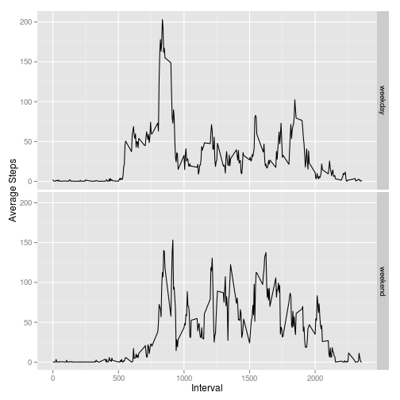

# Reproducible Research: Peer Assessment 1


## Loading and preprocessing the data

```r
unzip('activity.zip')
activity <- read.csv('activity.csv')
activity$posixDate = strptime(activity$date, format="%Y-%m-%d")
filteredActivity <- na.omit(activity)
```


## What is mean total number of steps taken per day?

```r
library(plyr)
stepsPerDay <- ddply(filteredActivity, "date", summarize,
                     totalSteps=sum(steps))
hist(stepsPerDay$totalSteps, main="Histogram of total steps per day",
     xlab="Total steps")
```

 

```r
meanSteps <- mean(stepsPerDay$totalSteps)
medianSteps <- median(stepsPerDay$totalSteps)
options(scipen=2)
```

The mean steps per day is 10766.1887;
the median steps per day is 10765.


## What is the average daily activity pattern?

```r
stepsPerInterval <- ddply(filteredActivity, "interval", summarize,
                          avgSteps=mean(steps))
plot(stepsPerInterval$interval, stepsPerInterval$avgSteps, type="l",
     xlab="5 minute interval", ylab="Steps",
     main="Average steps per time interval")
```

 

```r
maxIntervalSteps <- stepsPerInterval[which(stepsPerInterval$avgSteps==maxSteps),]
```
The interval with the most steps on average is 835
with a step average of 206.1698.


## Imputing missing values

```r
numMissingValues <- sum(is.na(activity$steps))

# make a copy of the data, filling in missing values with the average number
# of steps for that time interval
imputedActivity <- activity
imputedActivity$steps <- ifelse(
    is.na(imputedActivity$steps),
    stepsPerInterval[which(stepsPerInterval$interval==imputedActivity$interval),]$avgSteps[1],
    imputedActivity$steps)

imputedStepsPerDay <- ddply(imputedActivity, "date", summarize,
                            totalSteps=sum(steps))
hist(imputedStepsPerDay$totalSteps, main="Histogram of total steps per day",
     xlab="Total steps")
```

 

```r
imputedMeanSteps <- mean(imputedStepsPerDay$totalSteps)
imputedMedianSteps <- median(imputedStepsPerDay$totalSteps)
```

There are 2304 rows with missing values.  This
histogram shows total steps per day using imputed values for the
missing data.  Comparing this histogram to the earlier one, we see a
lot more data values in the 0-5000 bucket.  As we would expect since
there are so many new low values, the mean and median are lower.
Here, the mean steps per day is 9419.0807; the median steps
per day is 10395.


## Are there differences in activity patterns between weekdays and weekends?

```r
imputedActivity$dayType = ifelse(weekdays(imputedActivity$posixDate) == "Saturday"
                                 | weekdays(imputedActivity$posixDate) == "Sunday",
                                "weekend",
  			        "weekday")
stepsPerIntervalByDay <- ddply(imputedActivity, c("interval", "dayType"), summarize,
                          avgSteps=mean(steps))
library(ggplot2)
qplot(interval, avgSteps, ylab='Average Steps', xlab='Interval', data=stepsPerIntervalByDay, facets=dayType~., binwidth=2, geom='line')
```

 
